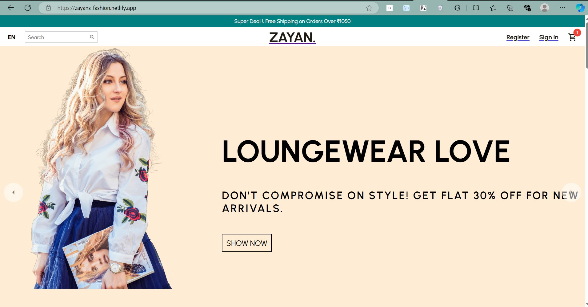

# Introduction

Building and deploying a **MERN Stack** application is a great way to experience full-stack development. MERN refers to the combination of **MongoDB**, **Express.js**, **React.js**, and **Node.js**, a popular stack for building dynamic web applications. This guide will walk you through cloning the code from [GitHub](https://github.com/abd-al-rahmanh) and viewing the live application hosted on [Netlify](https://zayans-fashion.netlify.app/).

---

## 🌍 What is MERN Stack?

The **MERN Stack** is a powerful framework that helps developers build web apps with a JavaScript-centric approach. It allows seamless interaction between the backend (Node.js and Express.js) and the frontend (React.js). With **MongoDB** as the database, it becomes a complete full-stack development solution.

### Key Components:
1. **MongoDB**: NoSQL database used to store application data.
2. **Express.js**: Web application framework for Node.js.
3. **React.js**: Front-end library for building user interfaces.
4. **Node.js**: JavaScript runtime used for the backend server.

---

## 🏗️ How to Run the MERN Stack Application Locally

### Step 1: Clone the GitHub Repository
Clone the repository from GitHub to get started with the MERN stack app locally:

```bash
git clone https://github.com/abd-al-rahmanh/mernfront.git
cd mernfront
```

### Step 2: Install Dependencies
Make sure you have Node.js installed. Then install the required dependencies:

```bash
npm install
```

### Step 3: Start the Application
Start the backend and frontend servers with:

```bash
npm start
```

You can view the application at `http://localhost:3000`.

---

## 🌐 Live Application

You can check out the live version of this MERN app hosted on **Netlify**: [zayans-fashion.netlify.app](https://zayans-fashion.netlify.app/).



---

## 🚀 Features of the Live MERN Stack App

1. **User Authentication**: Built-in user login and registration functionality.
2. **Responsive Design**: Fully responsive, mobile-first design with React.
3. **API Integration**: Uses Express.js to handle API routes.
4. **Database**: MongoDB integration for storing user data and application information.

---

## 📦 Project Structure

```bash
mern-app/
├── client/           # React.js frontend
├── server/           # Express.js backend
├── config/           # Configuration files
├── models/           # MongoDB models
├── routes/           # API routes
├── package.json      # Node.js dependencies
├── README.md         # Project documentation
```

The project follows a clean and organized structure for easy navigation and scalability.

---

## 🎉 Conclusion

This blog provided an overview of setting up and deploying a **MERN Stack** application, both locally and on Netlify. Whether you’re a beginner or a pro, the MERN stack offers flexibility and power for full-stack development. Explore the code on [GitHub](https://github.com/abd-al-rahmanh) and try it out yourself!

For more insights on MERN stack and web development, check out my other blogs.

---
For more interesting blogs on similar topics, check out the [Blog Section](https://abdulrahmanh.com/blog).

