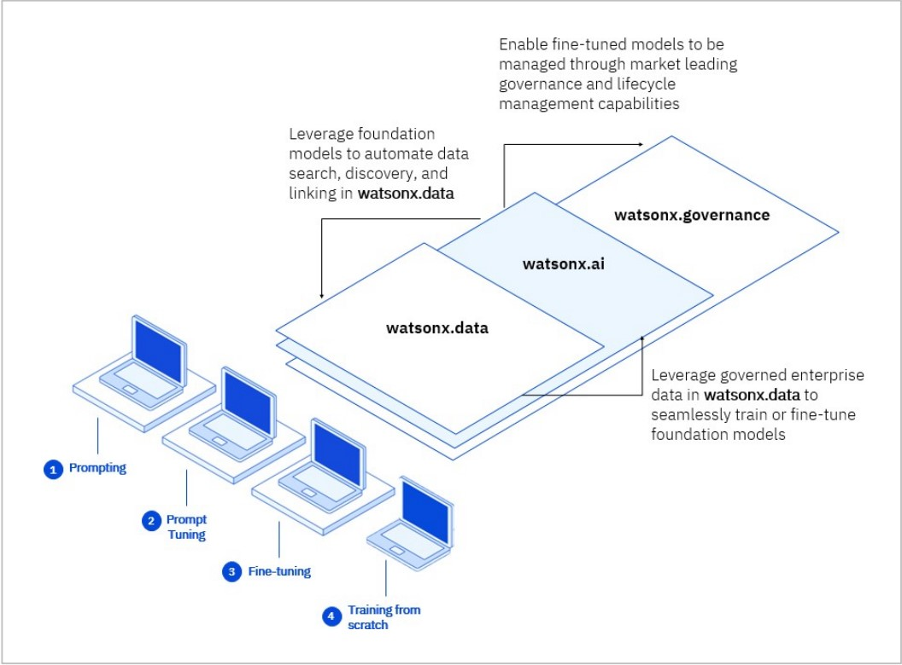

# Introduction

**IBM Watsonx** is IBM’s next-generation AI and data platform designed to scale and accelerate AI adoption across industries. It is a powerful suite of AI, data, and governance tools that support enterprise-level artificial intelligence, machine learning, and data science applications. Watsonx helps businesses and developers create and deploy AI models faster, making data-driven decisions more accessible.

In this guide, we’ll cover everything about IBM Watsonx, from its architecture, tools, and services to practical use cases and how you can master it from beginner to pro.

---

## 🌍 What is IBM Watsonx?

IBM Watsonx is a comprehensive AI platform that simplifies the building, training, and deployment of machine learning models. With Watsonx, you can access data, AI models, and tools under one platform that are tailored to different AI-related tasks.

### Key Components:
1. **Watsonx.ai**: AI model building and deployment platform.
2. **Watsonx.data**: Data management and processing platform for analytics.
3. **Watsonx.governance**: Tools to manage and govern AI models and data.
4. **Watsonx.ai**: A range of pre-built foundational models for natural language processing (NLP), computer vision, and more.

---

## 🏗️ IBM Watsonx Architecture

### IBM Watsonx.ai

Watsonx.ai is IBM’s AI model-building platform, equipped with pre-trained foundational models for various AI tasks such as NLP, speech-to-text, and computer vision.

- **Pre-trained Models**: IBM Watsonx offers a wide variety of foundational models that can be fine-tuned to specific business use cases.
- **Custom Model Building**: In addition to using pre-built models, you can build your own models from scratch using frameworks like TensorFlow and PyTorch.
- **Explainability**: Watsonx.ai includes explainability tools that allow users to understand how the model makes decisions, which is essential for businesses adopting AI at scale.

### IBM Watsonx.data

Watsonx.data is the backbone for managing, processing, and analyzing vast amounts of data. It integrates easily with cloud environments and supports various data types.

- **Data Integration**: It supports both structured and unstructured data from multiple sources.
- **Scalability**: Designed to scale with the demands of enterprise-level workloads, processing large datasets for AI training and analytics.
- **Data Lake Integration**: Watsonx.data integrates seamlessly with cloud data lakes for efficient data storage and retrieval.

### IBM Watsonx.governance

Watsonx.governance helps manage AI models and data throughout their lifecycle, ensuring compliance, transparency, and risk management.

- **Model Risk Management**: It includes tools to manage model risks, ensuring they comply with industry regulations.
- **Governance**: Provides a structured way to govern the data and models, ensuring the responsible use of AI.
- **Ethics and Fairness**: Built-in features to ensure fairness, transparency, and explainability in AI models.

---

## 💡 Key Features of IBM Watsonx

1. **AI Model Training and Deployment**: From foundational models to custom AI applications, Watsonx enables fast model deployment.
2. **Cloud-Native Platform**: Designed to work in hybrid cloud environments, making it highly scalable.
3. **Data Security and Governance**: Provides top-tier governance tools to ensure data and models are handled responsibly.
4. **AI-Powered Insights**: Delivers real-time insights from massive datasets using AI and machine learning algorithms.
5. **Open-Source Integration**: Supports popular AI frameworks and tools like TensorFlow, PyTorch, and Hugging Face.

---

## 🛠️ Types of IBM Watsonx Tools (With Examples)

### 1. Watsonx.ai

**Purpose**: To build, deploy, and manage AI models.  
**Example**: A retail company uses Watsonx.ai to analyze customer sentiment in product reviews and improve its recommendation system using NLP models.

### 2. Watsonx.data

**Purpose**: Manage and process large datasets.  
**Example**: A financial firm uses Watsonx.data to analyze stock market trends, leveraging AI models trained on historical data for real-time trading predictions.

### 3. Watsonx.governance

**Purpose**: Ensure AI models are transparent, fair, and compliant with regulations.  
**Example**: A healthcare company uses Watsonx.governance to manage the deployment of AI models for predicting patient outcomes, ensuring all models meet ethical standards.

---

## 🚀 How to Get Started with IBM Watsonx (Beginner to Pro)

### Beginner

1. **Explore Pre-Trained Models**: Start with pre-trained models for NLP or image recognition.
2. **Use IBM Watsonx.ai**: Deploy simple AI models using Watsonx’s user-friendly interface.
3. **Understand Data Handling**: Learn how Watsonx.data can process structured and unstructured data.

### Intermediate

1. **Fine-Tune Models**: Learn to fine-tune foundational models for specific business use cases.
2. **Leverage Watsonx.data for Analytics**: Dive deeper into data analytics and machine learning workflows.
3. **Implement AI Governance**: Start using Watsonx.governance tools to ensure compliance and ethical AI deployment.

### Pro

1. **Build Custom AI Models**: Develop and deploy advanced AI models using open-source libraries like PyTorch.
2. **Optimize for Scalability**: Use Watsonx to scale AI models across large datasets in hybrid cloud environments.
3. **Advanced Governance**: Implement complex governance workflows to manage AI models at an enterprise level, focusing on ethics, fairness, and risk management.

---

## ⚡ Use Cases of IBM Watsonx

1. **Healthcare**: Predict patient outcomes using Watsonx.ai models trained on medical records and clinical data.
2. **Finance**: Use Watsonx.data to analyze market trends and build AI models for automated trading.
3. **Retail**: Improve customer experience by deploying Watsonx-powered chatbots for customer support.

---

## 🚀 Conclusion

IBM Watsonx is revolutionizing AI adoption by making it easier for businesses to deploy, manage, and scale AI models across industries. Whether you're just starting with AI or are an experienced data scientist, Watsonx provides the tools needed to build, train, and govern AI models efficiently.

By mastering Watsonx.ai, Watsonx.data, and Watsonx.governance, you can fully leverage the power of AI to drive meaningful insights and innovation in your industry.

---

For more interesting blogs on similar topics, check out the [Blog Section](https://abdulrahmanh.com/blog).

 
