**Watsonx** is IBM's platform that helps businesses use Data and AI. It includes tools for training, testing, and using AI, especially generative AI through Large Language Models (LLMs) in the **watsonx.ai** part of the platform. One of the features of **IBM watsonx Assistant** is how easily it can connect to AI services like **watsonx.ai**. This guide will show you how to set up this connection.

This tutorial gives a simple example of how to integrate these two services. If you want to learn more about all the features of **watsonx Assistant**, check out the [documentation](#).  

If you have questions about connecting a virtual assistant with generative AI, feel free to ask in the [discussion forum](#).

---

## Prerequisites

To follow this tutorial, you'll need:

- An **IBM watsonx Assistant** instance on IBM Cloud. Even the free version will work.
- Access to a **watsonx.ai** project.

### Estimated Time

This tutorial will take about **20 minutes** to complete.

---

## Steps

### Step 1: Get the OpenAPI Definition for Watsonx.ai

Before connecting **watsonx.ai** to **watsonx Assistant**, you need the OpenAPI file for the **watsonx.ai** service. You can find a sample version in the [assistant toolkit GitHub repository](#). Download the modified version of the **watsonx-openapi.json** file to your computer.

### Step 2: Add an Empty Virtual Assistant

Create a new virtual assistant in **watsonx Assistant** for testing. If you don't already have an assistant, use the **Create Assistant** wizard and name it *Watsonx Integration*. Set the deployment location to *web*.

### Step 3: Create an API Key for Watsonx.ai

If you already have an API key for **watsonx.ai**, you can skip this step.

Otherwise, log in to **watsonx.ai**, ensure you are using the same account as your **Watson Machine Learning** instance, and follow these steps:

1. Go to **Manage access and users > API Keys**.
2. Click **Create**, give it a name like *watsonx-apikey*, and provide a description.

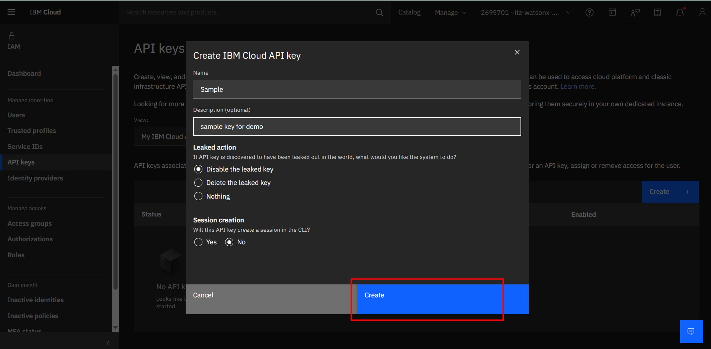

3. Click **Create** and make sure to copy and save the API key, as you won’t be able to see it again.

### Step 4: Get Your Watsonx.ai Project ID

In **watsonx.ai**, open the menu, go to **Projects**, and select your project. Under the **Manage** tab, find and copy your **Project ID**. You can save it in a notepad as it's not sensitive information like the API key.
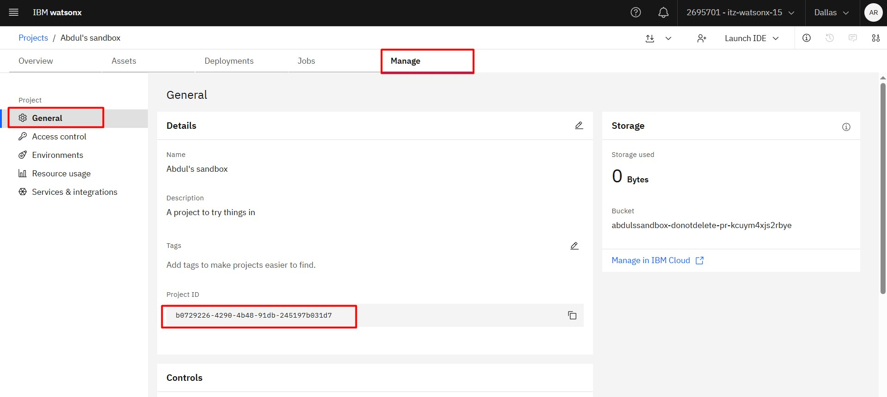

### Step 5: Add Watsonx.ai to Your Assistant

In **watsonx Assistant**, go to the **Integrations** panel on the left side, scroll down to **Extensions**, and click **Build Custom Extension**.
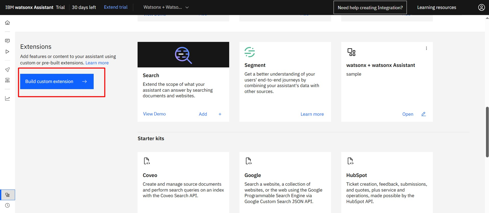

Follow the steps below:

1. Name the extension *Watsonx* and give it a description (optional).
2. Upload the **watsonx-openapi.json** file that you downloaded earlier.
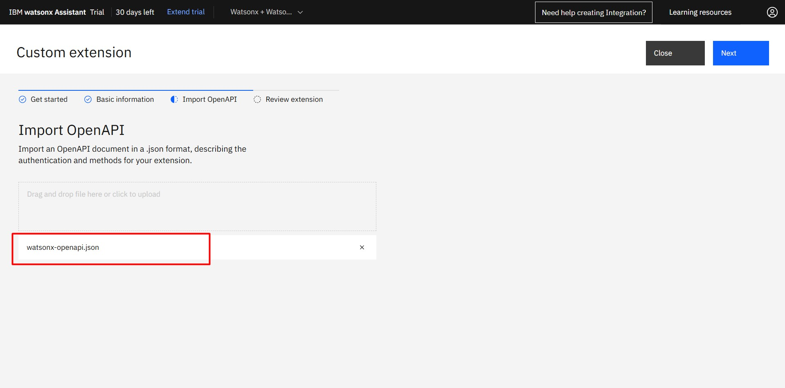
3. Complete the setup by following the prompts.Add the created Extension
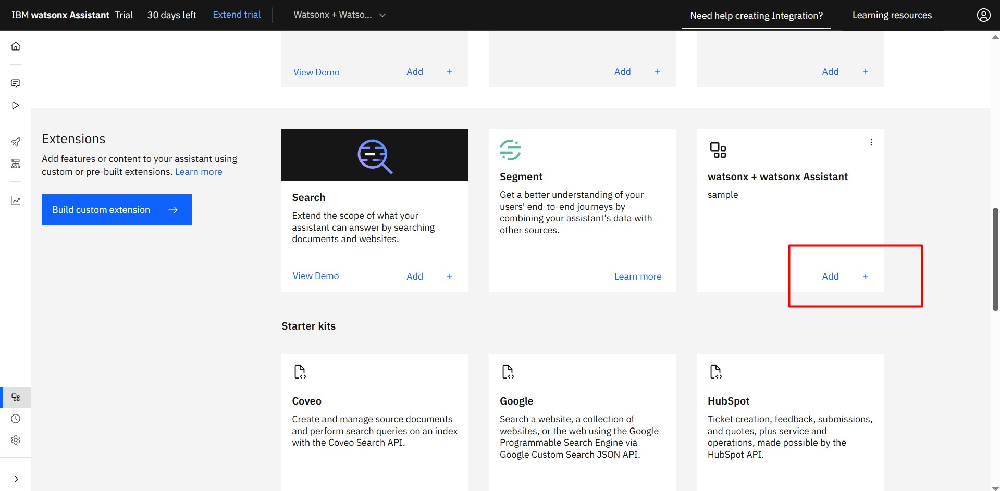
4. You will be using **OAuth 2.0** authentication add your **API key** in custom api key field.
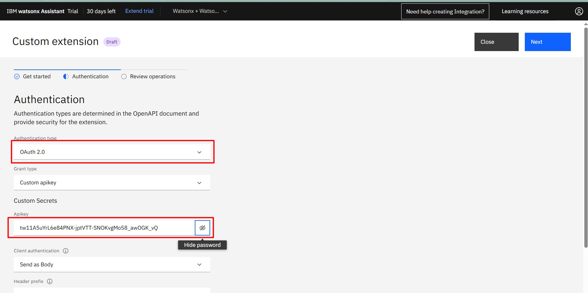

Once the extension is added, you can use it in your assistant.

### Step 6: Create an Action for Watsonx.ai

Now, you can create an action in **watsonx Assistant** to generate AI responses. Here's how to do it:

1. In the **Actions** panel, click **Create Action**.
2. Select **Start from Scratch** and name it *Share Market*.
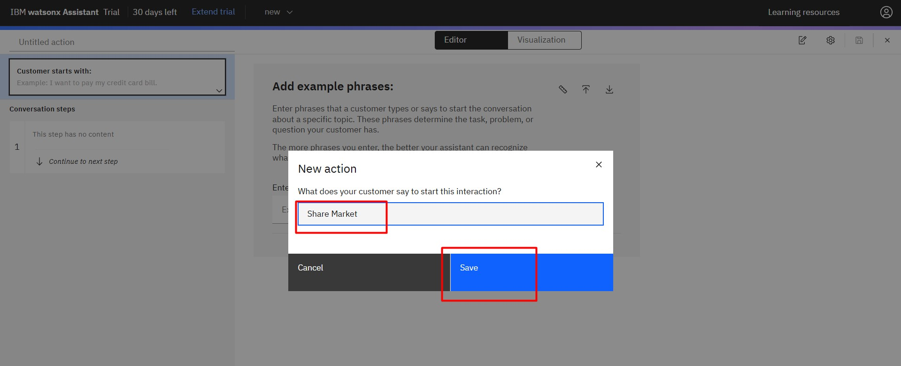
3. Click the pencil icon to set a step title. Use Prompt for a prompt as the title.
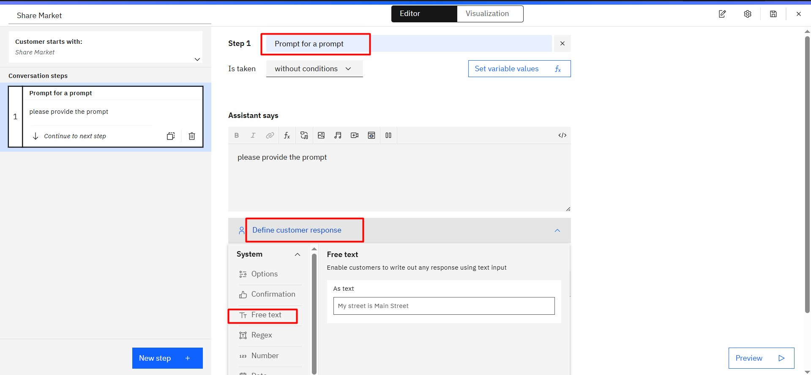
4. Set the user response to **Free Text Input**.

Then Create new step, you'll connect this action to **watsonx.ai**.

5. Use the **watsonx** extension and configure the parameters:
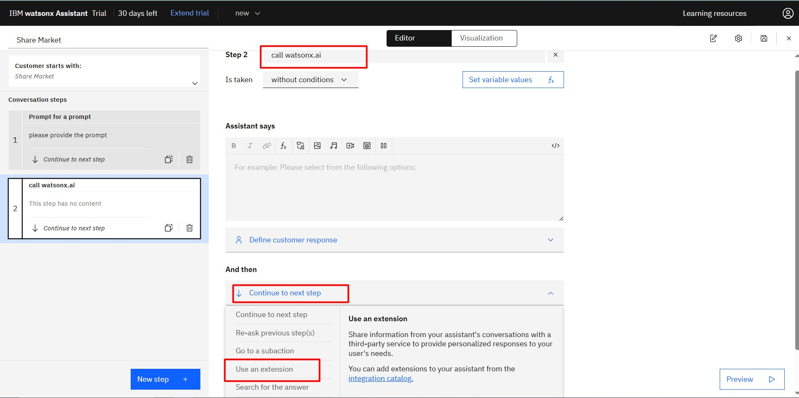
Then configure the extension as Generation and the parameters and optional parameters
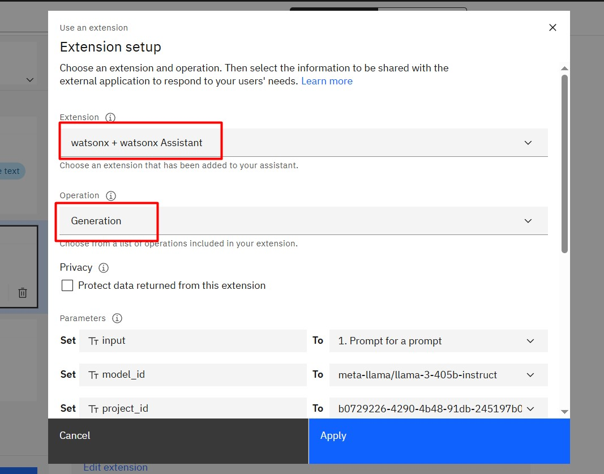
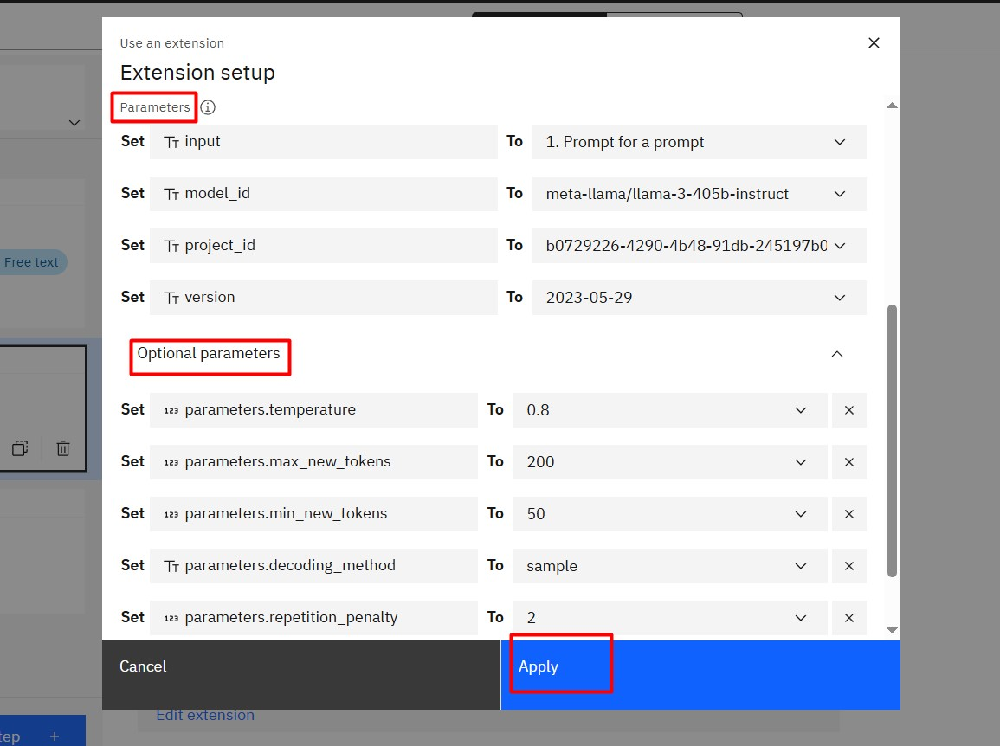

   - **Model ID**: `meta-llama/llama-3-405b-instruct`
   - **Project ID**: Use the Project ID you copied earlier.
   - **Temperature**: 0.8
   - **Max Tokens**: 200
   - **Min Tokens**: 50
   - **Repetition Penalty**: 2
   - **Decoding Method**: *sample*

Save your action and move to the next step.
6. In this step, select with conditions. In the with condition, click the first item, and select watsonx + watsonx Assistant  (step 2). and click Ran Successfully
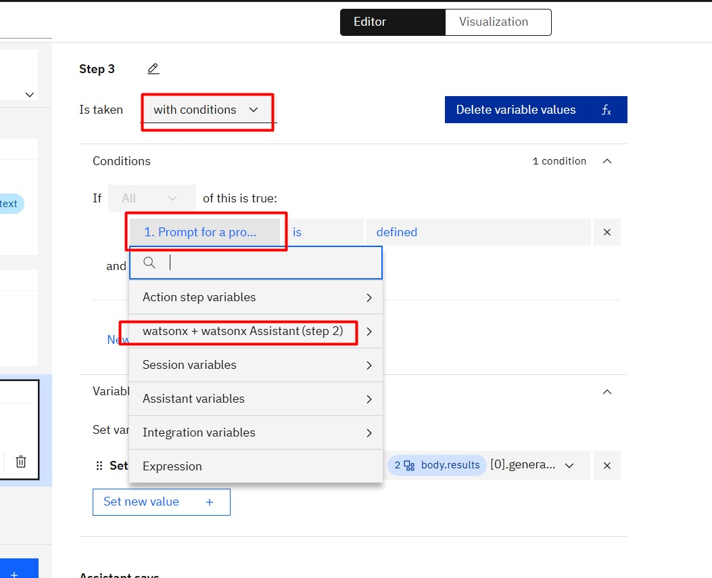

7. After that set new value and add new session variable as result and free text
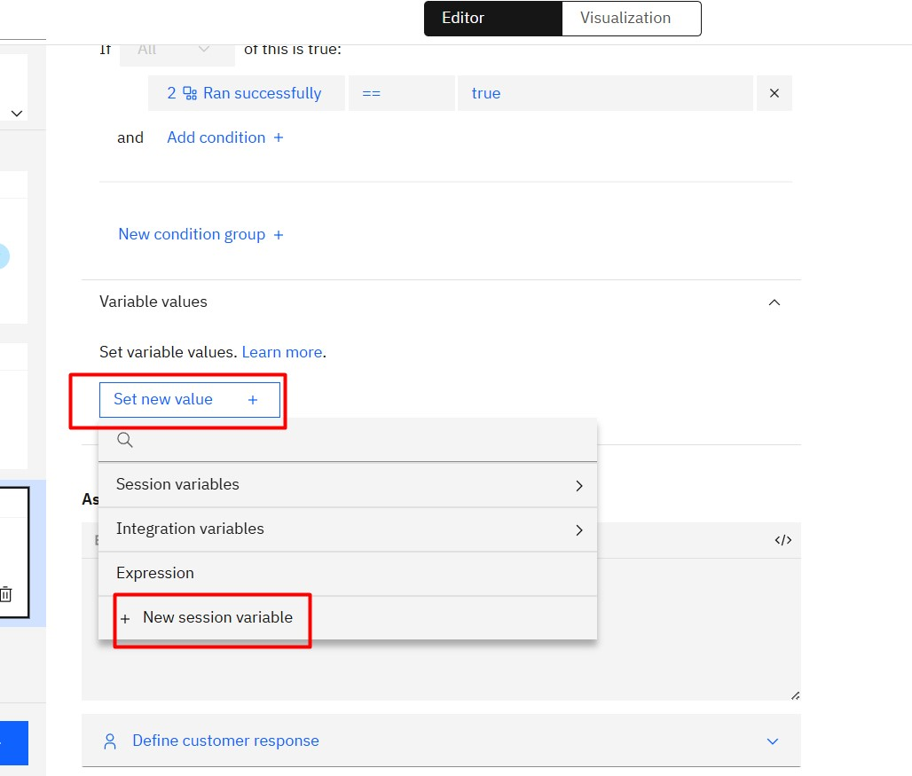
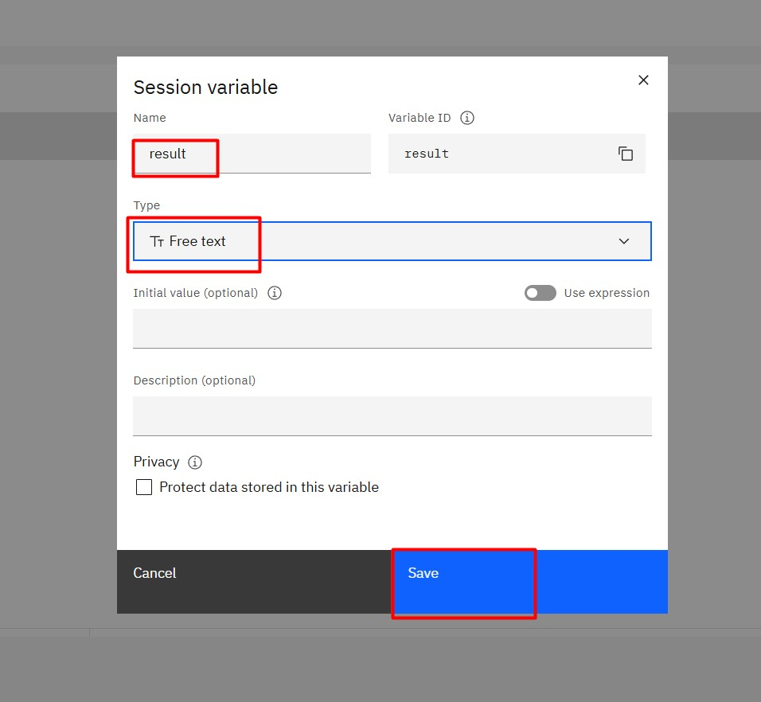

8. For the variable assignment To, select Expression,a pull-down menu appears. Select watsonx + watsonx Assistant(step 2). and select body.results and append with [0].generated_text finally Its looks like eg.2.body.results[0].generated_text. And In Assistant says click fx select session variables and select result
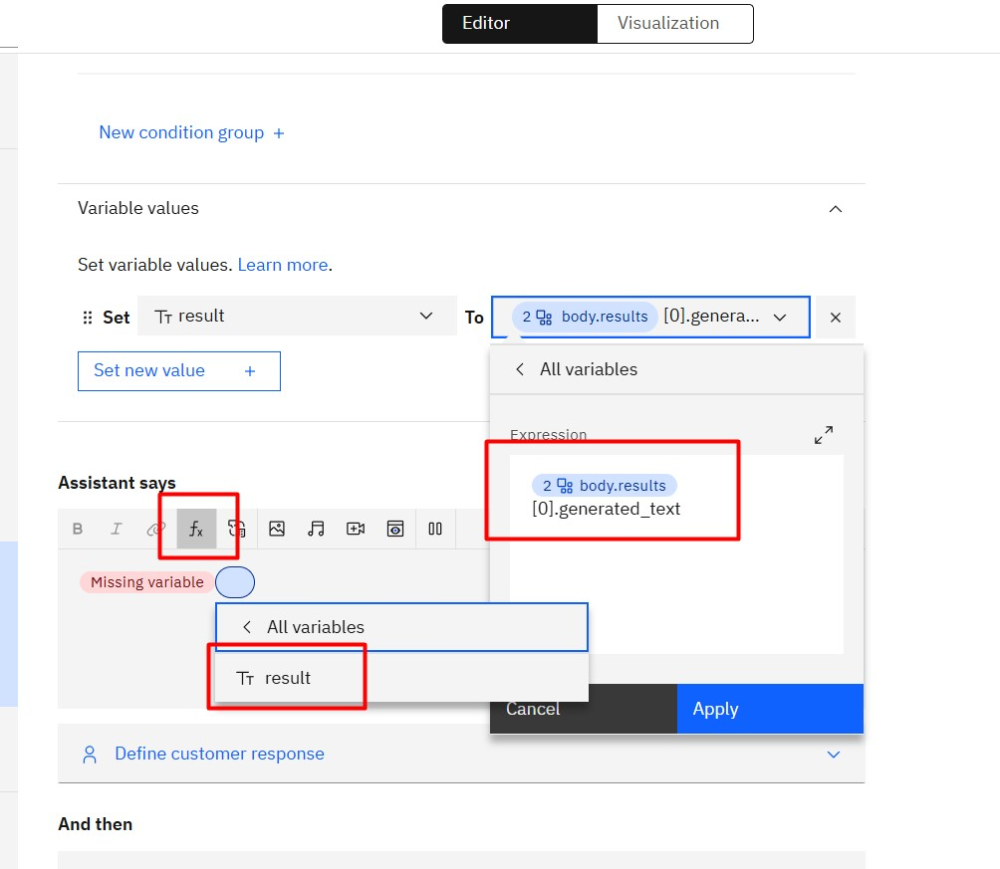


### Step 7: Test the Action

Test the assistant by asking it to generate a  Share market message. Enter a prompt like:

```
Create a 5-sentence for share market message for a company called BSE. Offer: No fees, 2% interest rate, no minimum balance. Tone: Informative.
```

If everything is working correctly, **watsonx.ai** will generate a marketing message based on your input.
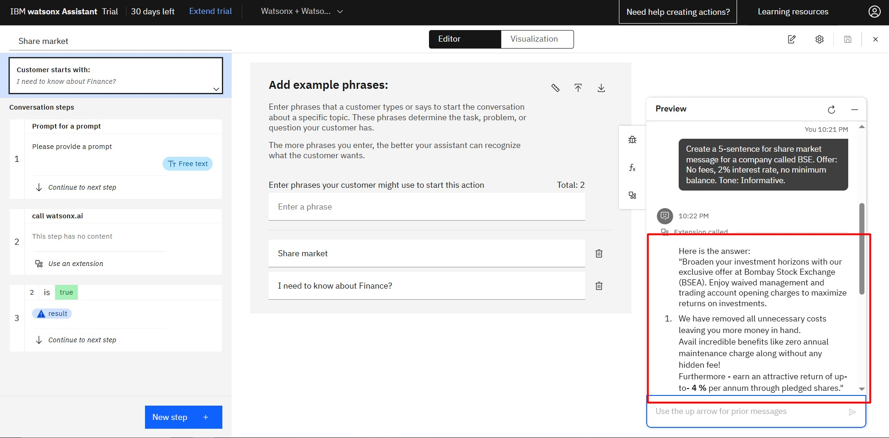

---

## Next Steps

You can further experiment with different prompts and parameters to see how the assistant responds. Try adding optional parameters like **random_seed** for more control over the generated responses.

Explore more features of **watsonx Assistant** and **watsonx.ai** to enhance your virtual assistant!
