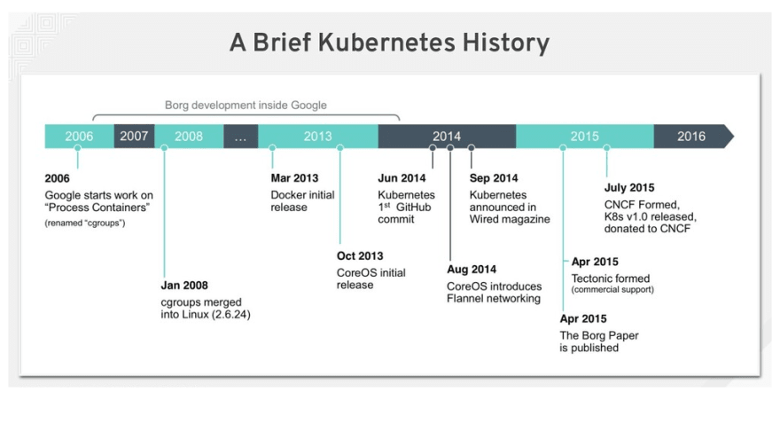
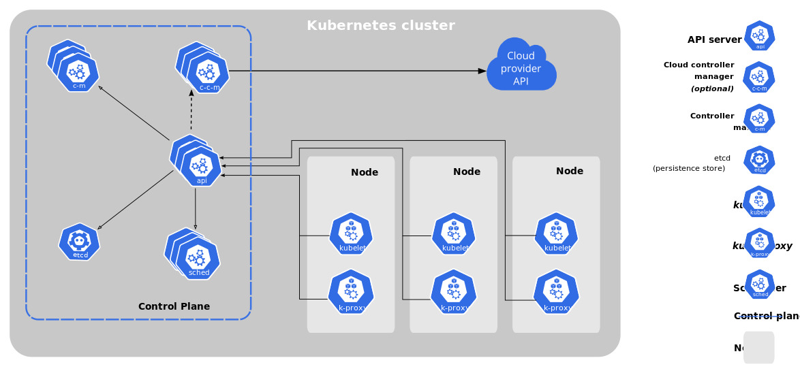
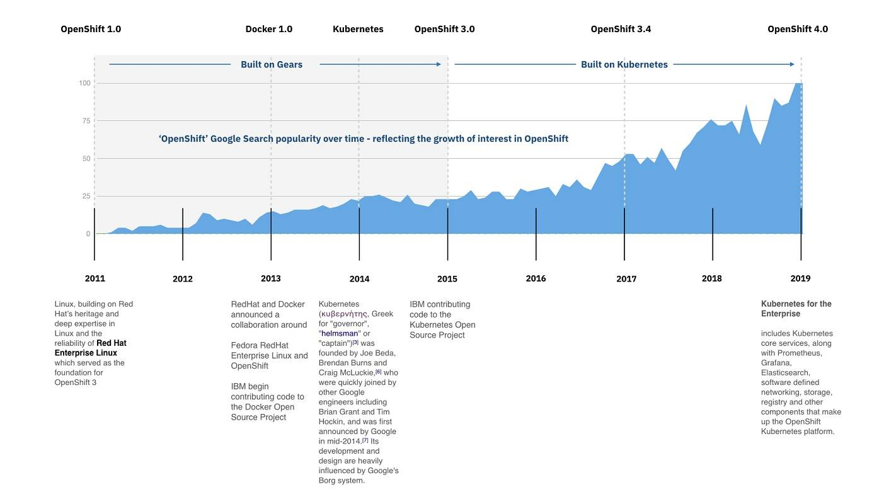

# Introduction

In this comprehensive guide, we will explore **Kubernetes** from its inception to its widespread adoption, along with the key platforms built on it. If you're new to Kubernetes or looking to deepen your understanding, this blog will guide you through all the essential aspects, starting with its history, core concepts, and even how to set up a Kubernetes cluster.

---

## Prerequisites

Before diving deep into Kubernetes, it’s helpful to have the following:

- Basic knowledge of Docker and containers
- Familiarity with Linux command-line operations
- A foundational understanding of cloud platforms

---

## 🌍 History of Kubernetes

Kubernetes, initially developed by Google in 2014, was born out of Google's internal system called **Borg**, which managed containers at a massive scale. Google open-sourced Kubernetes to the Cloud Native Computing Foundation (CNCF), and it has since become the standard for container orchestration.

### Key Milestones:
- **2014**: Kubernetes open-sourced by Google
- **2015**: v1.0 release, CNCF adoption
- **2016-2020**: Rapid growth, integrations with major cloud platforms (AWS, Azure, GCP)
- **2021-Present**: Kubernetes dominates the container orchestration landscape

---

## 🧐 Why Kubernetes?

Kubernetes has become the go-to platform for managing containerized applications. Its key features include:

- **Automated Rollouts & Rollbacks**: Ensures zero downtime during updates.
- **Self-healing**: Automatically replaces or restarts failed containers.
- **Horizontal Scaling**: Seamlessly scales your application up or down based on load.

---

## 🔑 Core Concepts

Understanding Kubernetes requires knowing its core building blocks:

- **Pods**: The smallest deployable units in Kubernetes that encapsulate one or more containers.
- **Services**: Define how Pods are accessed, either internally within the cluster or externally.
- **Deployments**: Manage the desired state of your applications and handle scaling.
- **ConfigMaps & Secrets**: Externalize configuration files and sensitive data (passwords, keys).

---

## 🏛 Kubernetes Architecture

The Kubernetes architecture consists of two main components: **Control Plane** and **Node (Worker Nodes)**.

### Control Plane:
1. **API Server**: Handles requests from the outside world and the cluster itself.
2. **Scheduler**: Schedules the pods on the nodes.
3. **Controller Manager**: Maintains the desired state of the cluster.
4. **etcd**: A distributed key-value store that holds all the data for the cluster.

### Nodes:
- **Kubelet**: An agent that ensures containers are running on the node.
- **Container Runtime**: The software responsible for running containers (e.g., Docker).
- **Kube Proxy**: Manages networking and forwards traffic.

---

## 🚀 Platforms Built on Kubernetes

Many popular platforms have been built on top of Kubernetes to harness its power:

- **Red Hat OpenShift**: A Kubernetes distribution focused on enterprise needs.
- **Rancher**: A multi-cluster Kubernetes management platform.
- **Google Kubernetes Engine (GKE)**: A managed Kubernetes service by Google Cloud.
- **Amazon EKS**: AWS’s managed Kubernetes service for deploying, managing, and scaling containerized applications.

---

## ⚙️ Popular Kubernetes Distributions

If you're looking to get started with Kubernetes, here are some of the most popular distributions:

- **Minikube**: Ideal for local development and testing.
- **K3s**: A lightweight Kubernetes distribution designed for IoT and edge devices.
- **MicroK8s**: A lightweight Kubernetes distribution for clouds and desktops.

---

## 🛠 Getting Started with Kubernetes

To set up a **Kubernetes Single Node Cluster Using Minikube on AWS EC2**, check out my detailed guide: [How to Set Up Minikube on AWS EC2](https://abdulrahmanh.com/blog/How-to-Set-Up-a-Kubernetes-Single-Node-Cluster-Using-Minikube-on-AWS-EC2).

### Key Steps:
1. **Install Docker**: Kubernetes needs a container runtime, and Docker is a great choice.
2. **Install Minikube**: Use Minikube to create a local Kubernetes cluster.
3. **Install kubectl**: Interact with your Kubernetes cluster using the `kubectl` command-line tool.
4. **Run Your First Application**: Deploy a simple NGINX server inside your Minikube cluster.

For a more detailed step-by-step guide, refer to the blog post linked above.

---

## 🌐 Kubernetes Workflow

Here's how Kubernetes works behind the scenes:

1. **Developer writes code** ➡️ Docker builds an image.
2. **Image gets stored** in a container registry (e.g., DockerHub).
3. **Kubernetes schedules the Pod** with the image to a node.
4. **Node runs the Pod**, and services expose it for external access.

---

## 📖 Conclusion

Kubernetes is a game-changer in the world of cloud-native applications, offering scalability, reliability, and ease of use for deploying containers at scale. From its robust architecture to its broad ecosystem, it's clear that Kubernetes is here to stay.

If you're just starting, setting up a Minikube cluster on AWS EC2 is a great way to familiarize yourself with Kubernetes basics.

---

