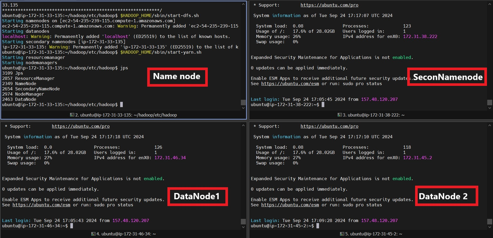
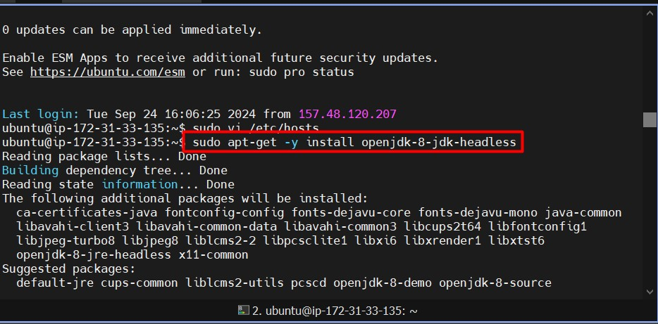
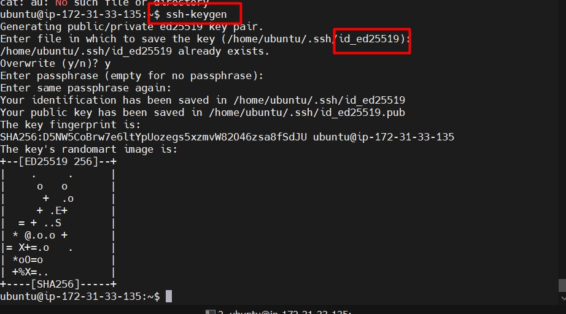
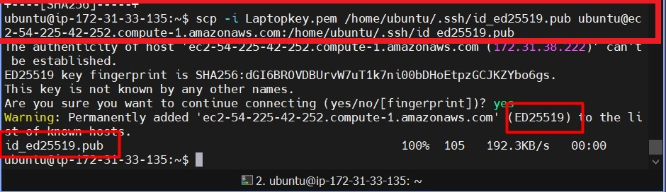
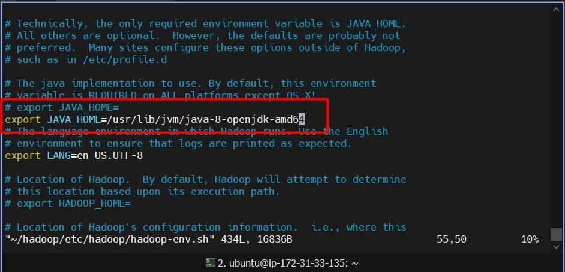
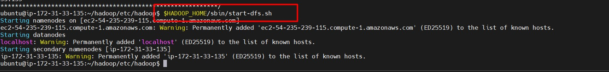
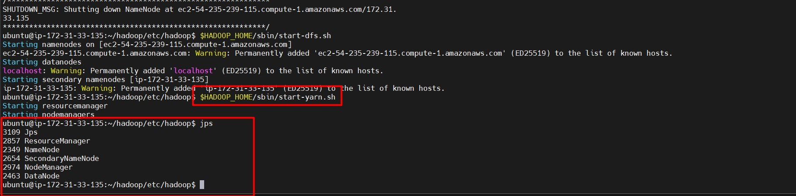

---

title: "How to Install and Run Apache Hadoop on AWS EC2 (Multi-Node Cluster)"
excerpt: "A detailed guide to setting up a multi-node Hadoop cluster on AWS EC2."

header:
  image: "../assets/images/posts/2024-09-05-How-to-Install-and-Run-Apache-Hadoop-on-AWS-EC2-Multi-Node-Cluster/cover.jpg"
  teaser: "../assets/images/posts/2024-09-05-How-to-Install-and-Run-Apache-Hadoop-on-AWS-EC2-Multi-Node-Cluster/cover.jpg"
  caption: "Data is the new oil, and Hadoop is the refinery. —Clive Humby"
categories: [Hadoop, AWS, EC2, Big Data]

---

# Introduction

To set up a multi-node Hadoop cluster on AWS EC2, follow the steps below. Ensure you’ve already created **4 EC2 instances** (NameNode, Secondary NameNode, DataNode1, DataNode2). If you're unfamiliar with setting up EC2 instances, check out my [Guide to Creating an EC2 Instance](https://abdulrahmanh.com/blog/How-to-Create-an-AWS-EC2-Instance) before proceeding. When launching EC2 instances, make sure to specify **4 instances**.

---

## Pre-requisites

1. **Create AWS EC2 Instances:**
   - Launch **4 Ubuntu EC2 instances** for NameNode, Secondary NameNode, and DataNodes (1 & 2). Assign names to your instances accordingly.

     

2. **SSH into the NameNode:**
   - Copy the key pair you created for the EC2 instances to the NameNode. First, locate the `.pem` file and execute the following command:

     ```bash
     scp -i Laptopkey.pem Laptopkey.pem ubuntu@<namenode_dns>:~/
     ```

3. **Update and Restart Instances:**
   - After logging into all 4 EC2 instances, update and restart them:

     ```bash
     sudo apt-get update && sudo apt-get -y dist-upgrade
     sudo reboot
     ```

4. **Update `/etc/hosts`:**
   - On each of the 4 instances, update the `/etc/hosts` file:

     ```bash
     sudo vi /etc/hosts
     ```

   - Replace `127.0.0.1 localhost` with the private IP and DNS of each instance. For example:

     ```
     172.31.45.2 ec2-54-172-91-40.compute-1.amazonaws.com
     ```

     

---

## Install Java and Hadoop

1. **Install Java:**
   - Install Java on all instances:

     ```bash
     sudo apt-get -y install openjdk-8-jdk-headless
     ```

     

2. **Download Hadoop:**
   - Download and extract Hadoop on all 4 instances:

     ```bash
     wget https://dlcdn.apache.org/hadoop/common/hadoop-3.4.0/hadoop-3.4.0.tar.gz
     tar -xvzf hadoop-3.4.0.tar.gz
     mv hadoop-3.4.0 hadoop
     ```

3. **Update `.bashrc`:**
   - Update the `.bashrc` file on all 4 instances:

     ```bash
     vi ~/.bashrc
     ```

   - Add the following lines:

     ```bash
     export JAVA_HOME=/usr/lib/jvm/java-8-openjdk-amd64
     export HADOOP_HOME=/home/ubuntu/hadoop
     export HADOOP_CONF=$HADOOP_HOME/etc/hadoop
     export PATH=$PATH:$JAVA_HOME:$HADOOP_HOME/bin
     ```

4. **Source the `.bashrc` file:**

     ```bash
     source ~/.bashrc
     ```

---

## Configure Password-less SSH

1. **Generate SSH Keys on NameNode (Master):**

   ```bash
   ssh-keygen
   ```

   

   - Copy the public key to all other nodes:

     ```bash
     scp -i Laptopkey.pem /home/ubuntu/.ssh/id_ed25519.pub ubuntu@ec2-54-172-91-40.compute-1.amazonaws.com:/home/ubuntu/.ssh/id_ed25519.pub
     ```

     

   - Then append the public key to the `authorized_keys` file:

     ```bash
     cat ~/.ssh/id_ed25519.pub >> ~/.ssh/authorized_keys
     ```

2. **Set up SSH Config:**
   - Modify `~/.ssh/config` on the **NameNode**:

     ```bash
     vi ~/.ssh/config
     ```

   - Add the following:

     ```bash
     Host nnode
       HostName <namenode_dns>
       User ubuntu
       IdentityFile ~/.ssh/id_ed25519

     Host snnode
       HostName <secondary_namenode_dns>
       User ubuntu
       IdentityFile ~/.ssh/id_ed25519

     Host dnode1
       HostName <datanode1_dns>
       User ubuntu
       IdentityFile ~/.ssh/id_ed25519

     Host dnode2
       HostName <datanode2_dns>
       User ubuntu
       IdentityFile ~/.ssh/id_ed25519
     ```

---

## Set up Hadoop Cluster

1. **Create HDFS Directories on All Nodes:**

   ```bash
   sudo mkdir -p /usr/local/hadoop/hdfs/data
   sudo chown -R ubuntu:ubuntu /usr/local/hadoop/hdfs/data
   ```

   

2. **Configure Hadoop Files:**
   - Modify the following Hadoop configuration files:

     - **`hadoop-env.sh`:**

       ```bash
       vi $HADOOP_HOME/etc/hadoop/hadoop-env.sh
       ```

       - Add or update the following line:

         ```bash
         export JAVA_HOME=/usr/lib/jvm/java-8-openjdk-amd64
         ```

       

     - **`core-site.xml`:**

       ```bash
       vi $HADOOP_HOME/etc/hadoop/core-site.xml
       ```

       - Add the following configuration:

         ```xml
         <configuration>
           <property>
             <name>fs.defaultFS</name>
             <value>hdfs://<namenode_dns>:9000</value>
           </property>
         </configuration>
         ```

     - **`hdfs-site.xml`:**

       ```bash
       vi $HADOOP_HOME/etc/hadoop/hdfs-site.xml
       ```

       - Add the following configuration:

         ```xml
         <configuration>
           <property>
             <name>dfs.replication</name>
             <value>3</value>
           </property>
           <property>
             <name>dfs.namenode.name.dir</name>
             <value>file:///usr/local/hadoop/hdfs/data</value>
           </property>
         </configuration>
         ```

     - **`mapred-site.xml`:**

       ```bash
       vi $HADOOP_HOME/etc/hadoop/mapred-site.xml
       ```

       - Add the following configuration:

         ```xml
         <configuration>
           <property>
             <name>mapreduce.framework.name</name>
             <value>yarn</value>
           </property>
         </configuration>
         ```

     - **`yarn-site.xml`:**

       ```bash
       vi $HADOOP_HOME/etc/hadoop/yarn-site.xml
       ```

       - Add the following configuration:

         ```xml
         <configuration>
           <property>
             <name>yarn.resourcemanager.hostname</name>
             <value><namenode_dns></value>
           </property>
         </configuration>
         ```

   - Navigate to the Hadoop configuration directory:

     ```bash
     cd $HADOOP_HOME/etc/hadoop
     ```

3. **Copy Configuration Files to Slaves:**

   - Copy the configuration files from NameNode to the slave nodes:

     ```bash
     scp hadoop-env.sh core-site.xml hdfs-site.xml mapred-site.xml yarn-site.xml ubuntu@<SlaveDNS>:~/hadoop/etc/hadoop/
     ```

4. **Set up Masters and Slaves:**

   - On **NameNode** and **Secondary NameNode**, edit the `masters` file:

     ```bash
     vi $HADOOP_HOME/etc/hadoop/masters
     ```

     - Add the following:

       ```
       <namenode_dns>
       <secondary_namenode_dns>
       ```

   - On **DataNode1** and **DataNode2**, edit the `slaves` file:

     ```bash
     vi $HADOOP_HOME/etc/hadoop/slaves
     ```

     - Add the following (specific to each DataNode):

       ```
       <datanode1_dns>  # On DataNode1
       <datanode2_dns>  # On DataNode2
       ```

   - **Note:** Leave the `masters` file empty on DataNode1 and DataNode2.

---

## Start the Hadoop Cluster

1. **Format the NameNode:**

   ```bash
   hdfs namenode -format
   ```

2. **Start HDFS and YARN:**

   ```bash
   $HADOOP_HOME/sbin/start-dfs.sh
   $HADOOP_HOME/sbin/start-yarn.sh
   ```

   

3. **Verify Hadoop Cluster:**
   - Use the following command on each node to verify the daemons:

     ```bash
     jps
     ```

     

---

## Conclusion

That's it! You now have Apache Hadoop running on a multi-node cluster on your EC2 instances. You can access the NameNode UI by visiting `http://<ec2-public-ip>:9870`.

**Final Output:**


---

 
