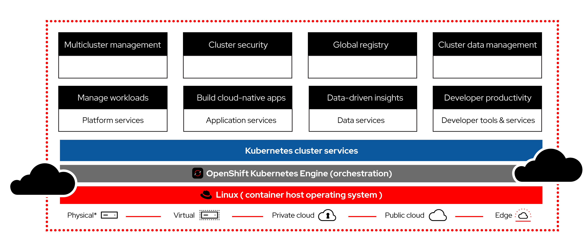
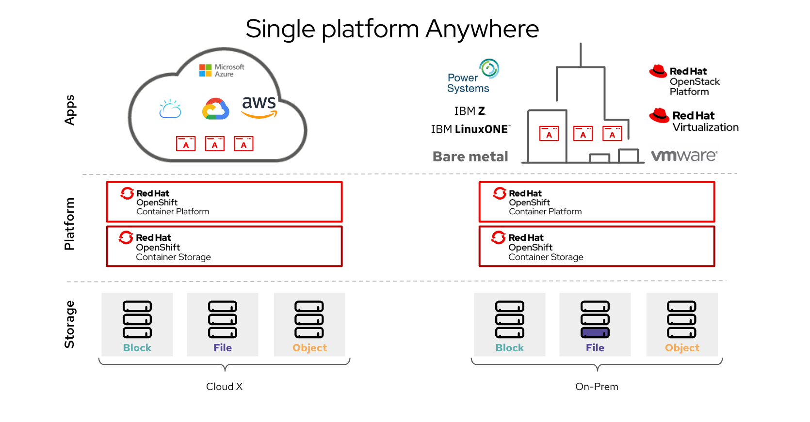

# Introduction

In this blog, we will delve deep into **OpenShift**, a powerful enterprise Kubernetes platform that simplifies container orchestration and application lifecycle management. By the end of this guide, both beginners and advanced users will have a comprehensive understanding of OpenShift, its architecture, deployment options, and prerequisites to get started.

OpenShift provides a platform for building and managing containerized applications, supporting various cloud and on-premises solutions. This guide covers OpenShift types, architecture, installation options (including **ROSA**, **ROKS**, **OpenShift Dedicated**, and **OKD**), and much more.

---

## 🌟 What is OpenShift?

**OpenShift** is a Kubernetes-based container platform developed by Red Hat, aimed at simplifying the management and deployment of containerized applications. It extends Kubernetes by adding powerful DevOps and developer tools, making it easier to deploy, scale, and manage workloads.

### Key Features:
- **Enterprise-Grade Security**: Provides strong RBAC, security policies, and container isolation.
- **Developer-Friendly**: Supports CI/CD pipelines, developer IDEs, and Source-to-Image (S2I) builds.
- **Multi-Cloud Support**: Can be deployed across multiple cloud providers or on-premises.

---

## 🏢 OpenShift Types

OpenShift comes in several deployment options, depending on your needs:

1. **OpenShift Container Platform (OCP)**:
   - Runs on your on-premises infrastructure or private cloud.
   - Offers full control over the Kubernetes environment.

2. **OpenShift Dedicated**:
   - Fully managed by Red Hat, runs on AWS or GCP.
   - Ideal for teams looking to focus on development without managing the underlying infrastructure.

3. **ROSA (Red Hat OpenShift Service on AWS)**:
   - A managed OpenShift service jointly managed by AWS and Red Hat.
   - Integrates deeply with AWS services, providing a seamless hybrid cloud experience.

4. **ROKS (Red Hat OpenShift on IBM Cloud)**:
   - A managed OpenShift service on IBM Cloud.
   - Offers enhanced integration with IBM Cloud services, including Watson and IBM Cloud Paks.

5. **OKD (OpenShift Kubernetes Distribution)**:
   - The upstream, community-supported version of OpenShift (similar to CentOS for RHEL).
   - Ideal for testing and learning OpenShift for free.

---

## 🏛️ OpenShift Architecture

The OpenShift architecture consists of several components that work together to manage and orchestrate containers. Key components include:

1. **Master Nodes**:
   - Manage the entire OpenShift cluster, schedule workloads, and handle API requests.
2. **Worker Nodes**:
   - Host the application Pods and provide compute power to run your containers.
3. **ETCD**:
   - A distributed key-value store that stores cluster state and configuration.
4. **Controller Manager & Scheduler**:
   - Controllers automate routine tasks, while the Scheduler allocates workloads to nodes.
5. **Ingress & Routes**:
   - OpenShift uses Routes to expose services externally, providing traffic management and load balancing.

### Additional OpenShift Tools:
- **BuildConfigs & ImageStreams**: Facilitate automatic builds and deployments.
- **Operators**: Manage complex applications with ease using Operators to automate tasks like upgrades and scaling.

---

## ⚙️ Prerequisites for OpenShift

Before installing OpenShift, ensure you meet the following prerequisites:

- **Hardware Requirements**:
  - Minimum 4 CPUs, 16 GB RAM for a single-node cluster.
  - For multi-node clusters, additional nodes with similar configurations.

- **Software Requirements**:
  - **Operating System**: RHEL 7/8, CentOS, or Fedora (for OpenShift Container Platform).
  - **Cloud Environment**: AWS, GCP, or Azure for cloud deployments.

- **CLI Tools**: Install `oc` and `kubectl` for interacting with OpenShift clusters.

---

## ☁️ Deployment Options

OpenShift can be installed on different platforms, depending on your needs:

1. **OpenShift on Cloud (ROSA, ROKS)**:
   - Provides a managed OpenShift experience with integrations specific to each cloud provider.

2. **OpenShift Dedicated**:
   - Red Hat manages the OpenShift cluster, letting you focus on developing and deploying applications.

3. **Self-Hosted OpenShift (OCP)**:
   - Install and run OpenShift on your own infrastructure.

4. **OKD for Development**:
   - Ideal for local development and testing, OKD can run on VirtualBox, AWS, or GCP.

### Why Installing OpenShift on Ubuntu is Challenging

While OpenShift can technically run on Ubuntu, it’s not officially supported by Red Hat. OpenShift Container Platform (OCP) is optimized for Red Hat Enterprise Linux (RHEL) and CentOS, which include dependencies and kernel modules tuned for OpenShift workloads. Using Ubuntu may lead to compatibility issues and lack of support from Red Hat.

---

## 🎯 Getting Started with OpenShift

For beginners, start with OpenShift Online or OKD for a free experience. Once familiar, consider moving to OpenShift Dedicated or ROSA for production use. For advanced users, deploying OpenShift Container Platform (OCP) on your infrastructure gives the most control.

---

## 📌 Summary

OpenShift is a versatile platform that simplifies the complexities of managing containerized applications. It offers several flavors like ROSA, ROKS, and OpenShift Dedicated, catering to different use cases. From beginners to pros, OpenShift has something for everyone.

If you're looking to get started, feel free to get a **[Free OpenShift Dedicated Cluster](https://abdulrahmanh.com/blog/openshift-dedicated)** to test and deploy your applications!

