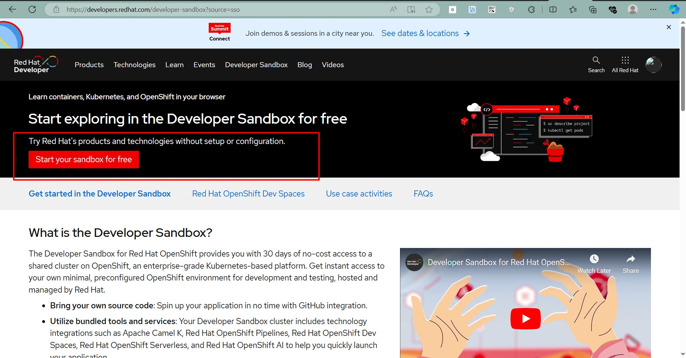
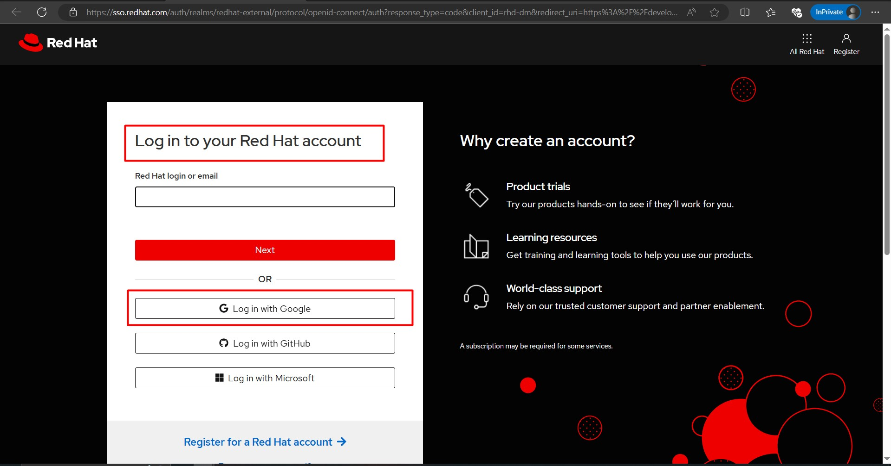
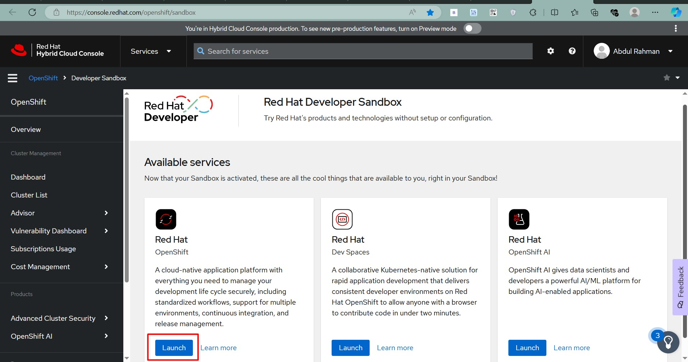
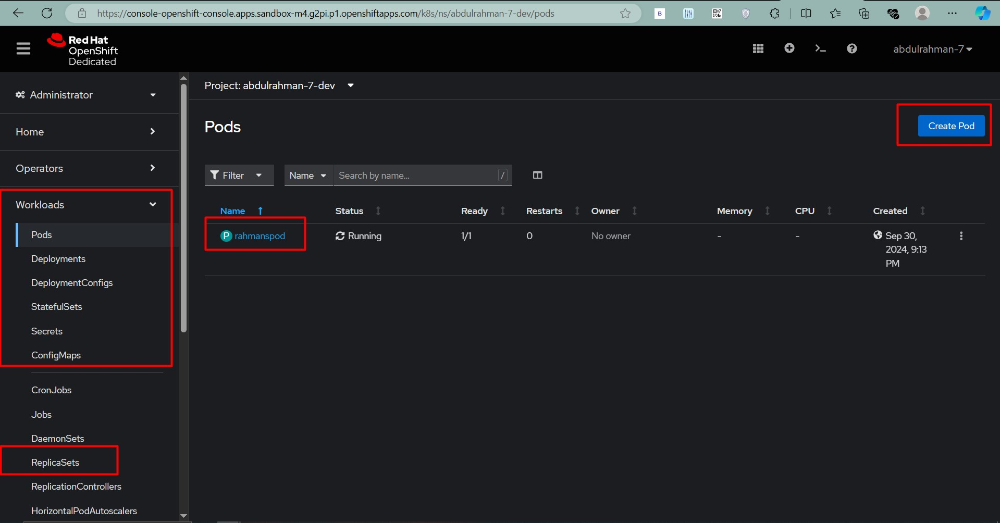
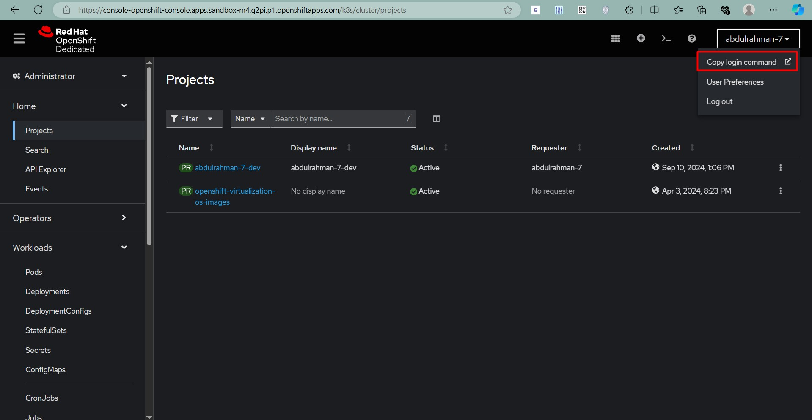
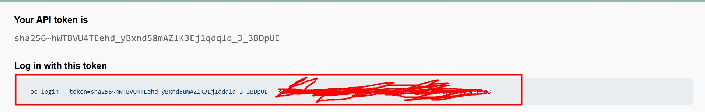

# Introduction

OpenShift Dedicated is a powerful, enterprise-ready Kubernetes platform that provides developers with an efficient way to build, deploy, and scale applications in the cloud. Getting access to a free OpenShift Developer Sandbox is a fantastic opportunity for developers to explore its capabilities without incurring costs.

In this guide, we will walk through how to sign up for a free OpenShift Developer Sandbox, access the OpenShift Console, and perform basic operations like creating pods and deployments.

---

## ⚡ Why Choose OpenShift?

OpenShift Dedicated offers a managed Kubernetes environment, complete with developer and operational tools, enabling seamless collaboration and rapid application development. With features like CI/CD integration, automated updates, and built-in security, OpenShift is ideal for cloud-native application development.

**Key Features:**
1. **Developer Sandbox**: A free, temporary environment to explore and develop with OpenShift.
2. **Multi-cluster Support**: Easily manage resources across multiple clusters.
3. **CI/CD Pipelines**: Integrate with Jenkins, Tekton, and other CI/CD tools.
4. **Rich Ecosystem**: Includes Operators, Helm Charts, and Templates for quick application deployment.

---

## 🛠️ How to Get a Free OpenShift Developer Sandbox

To get started with the OpenShift Developer Sandbox, follow the steps below:

### Step 1: Visit the OpenShift Developer Sandbox Page

- Open your browser and go to the [OpenShift Developer Sandbox](https://developers.redhat.com/developer-sandbox) page.



### Step 2: Sign Up or Log In

- If you **already have a Red Hat account**:
  - Click **Log In** and enter your credentials.
- If you **do not have a Red Hat account**:
  - Click on **Register** to create a new account.
  - Fill out the registration form with your details and confirm your email to activate the account.



### Step 3: Start the Developer Sandbox

- After logging in or registering, you’ll be redirected to the Developer Sandbox dashboard.
- Click on **"Start using the Developer Sandbox"**.

### Step 4: Accept the Terms and Conditions

- You will be prompted to review and accept the Red Hat Developer Sandbox terms.
- Click **"Accept"** to proceed.

### Step 5: Provision Your Sandbox

- The sandbox will be provisioned for your account. This may take a few minutes.
- You will see a loading screen, and once the setup is complete, you’ll receive a confirmation email.

### Step 6: Access Your Sandbox

- Once provisioned, you’ll be redirected to the OpenShift Web Console.
- You can also access it from the confirmation email containing your sandbox URL.

### Step 7: Log In to OpenShift

- Click on the sandbox URL or go to [OpenShift Console](https://console.redhat.com/openshift/sandbox).
- Log in using your Red Hat credentials.



### Step 8: Start Using the Sandbox

- Begin by creating a new project and deploying a sample application.
- Explore the **Developer** and **Administrator** perspectives to get familiar with OpenShift’s capabilities.



---

## 🚀 Working with OpenShift Dedicated

Once you have access to your dedicated OpenShift cluster, you can begin deploying applications, creating resources, and managing configurations. Below are some common tasks to get you started:

# **Downloading and Using `oc` CLI**

To manage OpenShift resources, you can use the `oc` command-line tool:

1. **Download the CLI**:
   - In the OpenShift console, click on the **question mark (?) icon** in the top-right corner.
   - Select **Command Line Tools** and download the appropriate `oc` binary for your OS.

   

2. **Log in Using the CLI**:
   - Click on your username in the top-right corner and select **Copy Login Command**.
   - Copy the `oc login` command displayed and paste it into your terminal.
   - The execution should done in oc where **oc.exe** file is extracted.

   

   For example:
   ```bash
   oc login https://api.dedicated-cluster1.us-east-1.openshiftapps.com:6443 --token=<your_token>
   ```

### 1. **Creating and Managing Projects**

Projects in OpenShift are equivalent to namespaces in Kubernetes. Before deploying any resources, create a new project:

```bash
oc new-project my-app
```

Switch to the newly created project:

```bash
oc project my-app
```

### 2. **Deploying a Sample Application**

Deploy a Node.js application from a GitHub repository using the `oc new-app` command:

```bash
oc new-app nodejs~https://github.com/rahman/nodejs-ex
```

This command will automatically create a deployment, build the image from the source code, and deploy the application pods.

### 3. **Creating and Managing Pods and Deployments**

You can manually create Pods and Deployments using YAML files or commands:

**Create a Deployment:**

```bash
oc create deployment my-deployment --image=nginx
```

**Scale the Deployment:**

```bash
oc scale deployment my-deployment --replicas=3
```

### 4. **Exposing Your Application**

After deploying your application, expose it using a service and route:

**Expose a Service:**

```bash
oc expose deployment my-deployment --port=80
```

**Create a Route:**

```bash
oc expose svc/my-deployment
```

The route URL will be displayed, and you can access your application from a web browser.


### 6. **Monitoring and Troubleshooting**

Use the following commands to view logs and debug issues:

- **View Logs**:
  ```bash
  oc logs pod-name
  ```

- **Describe a Resource**:
  ```bash
  oc describe pod pod-name
  ```

---

## 🌐 Conclusion

With this guide, you now have the knowledge to get started with a free OpenShift Developer Sandbox and perform basic operations in OpenShift Dedicated clusters. Take advantage of this environment to explore cloud-native development, deploy applications, and test CI/CD workflows.

If you encounter any issues or have questions, feel free to ask for help in the Red Hat Developer community or explore the documentation!

**Happy OpenShift-ing!**
```

---
